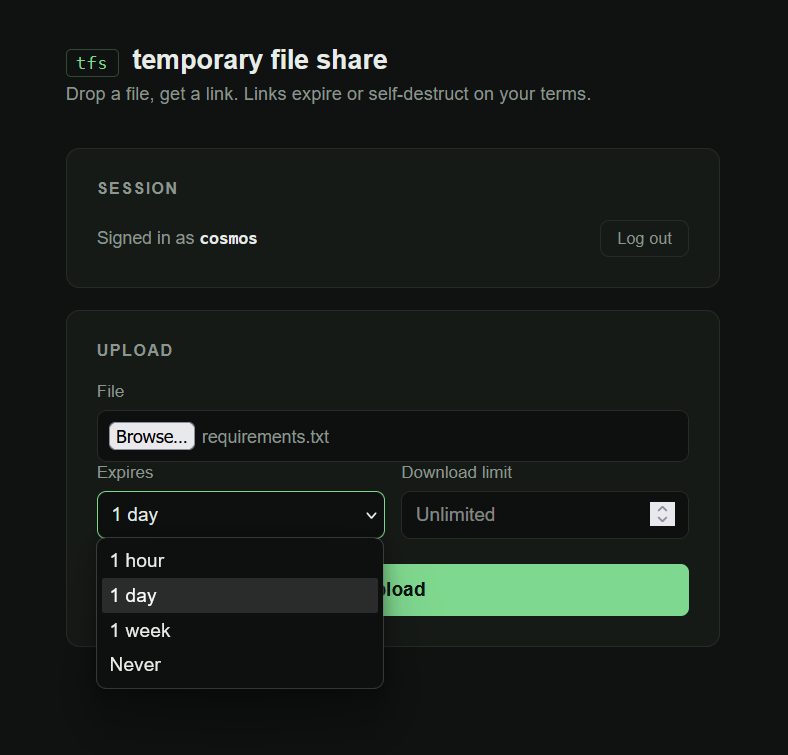

# TFS — Temporary File Share

A self-hostable file-sharing API with expiring links, download limits, and per-user auth — built with FastAPI, SQLAlchemy, and PostgreSQL, containerized with Docker.

Upload a file, get back a short link. The link can expire after a set time, run out after a set number of downloads, or both — and a background job automatically cleans up expired files from disk and the database, so nothing lingers.



## Features

- **Short-link file sharing** — upload a file, receive a collision-free short code as a shareable link
- **Configurable expiry** — 1 hour, 1 day, 1 week, or never, set per upload
- **Download limits** — cap a link to N downloads (or unlimited), enforced with an atomic decrement to avoid race conditions on simultaneous requests
- **Self-healing storage** — if a file is ever missing from disk but still referenced in the database (or vice versa), the API cleans up the stale record automatically instead of erroring
- **Background cleanup job** — an APScheduler job runs on an interval, physically deleting expired or download-exhausted files from disk and the database
- **JWT authentication** — register/login with hashed passwords (bcrypt via passlib), JWT-protected upload endpoint, per-user file ownership
- **PostgreSQL + Docker Compose** — fully containerized, with a healthcheck-gated startup so the app never race-starts ahead of the database
- **Minimal demo UI** — a single-page HTML/JS frontend for exercising the API without needing a REST client

## Tech stack

| Layer | Choice |
|---|---|
| Framework | FastAPI |
| ORM | SQLAlchemy 2.0 (declarative, `Mapped`/`mapped_column` style) |
| Database | PostgreSQL (SQLite used during early development — see [Releases](#releases)) |
| Auth | JWT (`python-jose`) + bcrypt password hashing (`passlib`) |
| Scheduling | APScheduler (background cleanup job) |
| Containerization | Docker, Docker Compose |

## Architecture notes

A few decisions worth calling out, since they're the parts that involved actual tradeoffs rather than boilerplate:

- **Atomic download-limit enforcement.** A naive "check count, then decrement" approach has a race condition: two simultaneous requests against a one-download-remaining link could both pass the check before either commits, letting both downloads through. The decrement is instead done as a single conditional `UPDATE` statement, so the database itself guarantees only one request can win.
- **Disk filenames are decoupled from user-supplied filenames.** Files are stored on disk under their short code, not their original name, which avoids collisions when multiple uploads share a filename. The original filename is preserved separately in the database and returned via `Content-Disposition` on download, so the file downloads under its real name regardless of what it's called on disk.
- **Naive vs. timezone-aware datetimes.** SQLite always returns naive datetimes regardless of what's stored; PostgreSQL preserves timezone awareness. Migrating between the two required standardizing datetime comparisons to match whichever database was active — a real, easy-to-miss gotcha when moving from a SQLite prototype to a Postgres deployment.
- **Startup ordering in Docker Compose.** `depends_on` alone only guarantees container *start* order, not that Postgres is actually ready to accept connections — the app would occasionally start faster than Postgres finished initializing. A healthcheck (`pg_isready`) gates the app's startup on Postgres actually being ready, not just running.

## Releases

Two tagged releases are available, reflecting the project's progression:

- **v1 (SQLite)** — the initial working version, built before the Docker/PostgreSQL migration
- **v2 (PostgreSQL + Docker)** — the current, containerized version described in this README

## Running locally

```bash
git clone https://github.com/cosmos-creator/Temporary-File-Share-API.git
cd Temporary-File-Share-API
cp .env.example .env
```

Open `.env` and set `SECRET_KEY` to your own long, random string.

```bash
docker-compose up --build
```

Once running:
- API docs: `http://localhost:8000/docs`
- Demo UI: `http://localhost:8000/`

You'll need a `.env` file with a `SECRET_KEY` for JWT signing — see `.env.example` for the expected format.

## API overview

| Method | Endpoint | Description |
|---|---|---|
| `GET` | `/ping` | Basic liveness check |
| `GET` | `/health` | Health check |
| `POST` | `/register` | Create a new user account |
| `POST` | `/login` | Authenticate and receive a JWT |
| `POST` | `/upload/` | Upload a file (requires auth) — accepts an expiry option and optional download limit |
| `GET` | `/download/{code}` | Download a file by its short code |

Full interactive documentation is available at `/docs` once the app is running.

## Project status

Core functionality, authentication, and containerized deployment are complete and tested end-to-end. Open items:

- Automated test coverage (pytest) — not yet started
- Rate limiting on `/login` and `/register` — deliberately deferred in favor of a proper implementation later, rather than a quick fix

## License

MIT